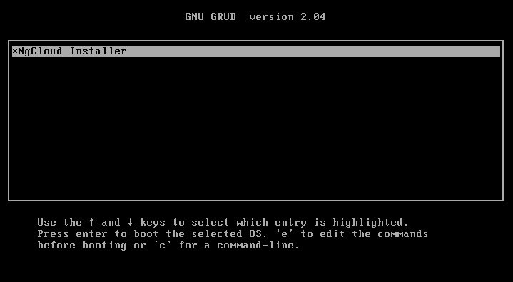
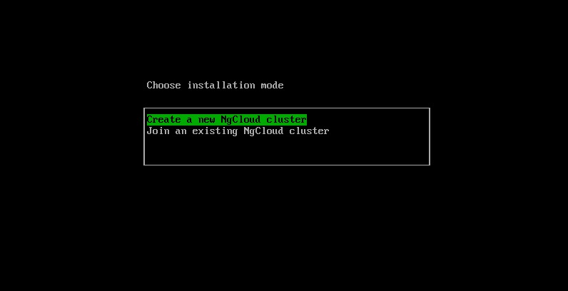
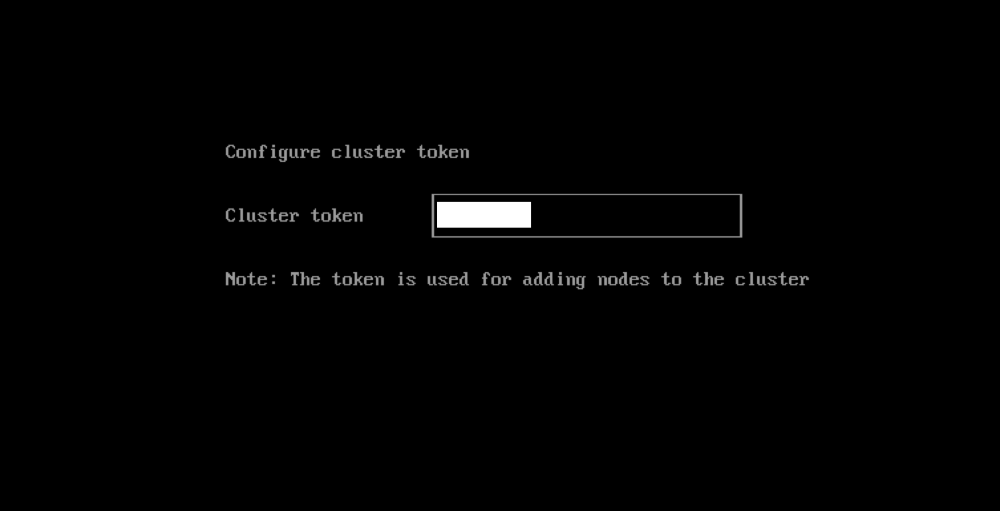
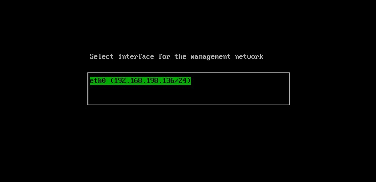
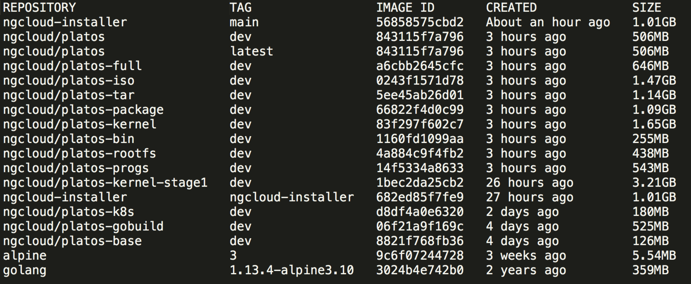

ngcloud-installer
========

Repo for building the nghci/ngcloud ISO image.

0-1 to build cloud, like `harvester`

## Building

`make`

Built ISO image is located in the `dist/artifacts` directory.


```shell script
./build
```

## DevOps

- package
    - grub system
    - kernel 
    - kernel modules
    - OS programs
    - golang build env 
    - root filesystem 
    - ng cloud binary
    - upgrade package
    - development package
    - foundation layer, kubernetes ecosystem 
    - helm package 
    - container runtime
    - iso builder
    - docker images 
    - toolbox image & binary


## cloud sdk for ng cloud

- go sdk 
- business model 
- middleware client go
- framework architecture

## Demo

### Usage 









### Container Images




